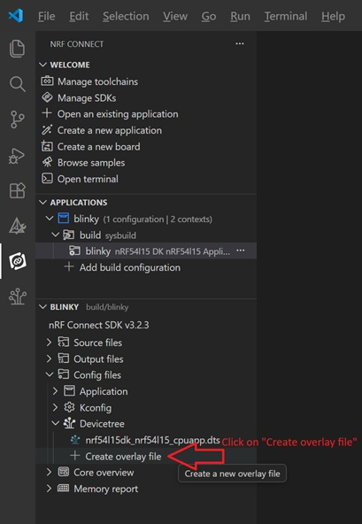

# DeviceTree: Changing the LED port pin

Used pins for LEDs on nRF54L15DK:
| LED  | Pin            |
|------|----------------|
| LED0 | Port 2, Pin 9  |
| LED1 | Port 1, Pin 10 |
| LED2 | Port 2, Pin 7  |
| LED3 | Port 1, Pin 14 |

Let's start by modifying the LED used: 

1) Create overlay file: <code>nrf54l15dk_nrf54l15_cpuapp.overlay</code>

   

There are several ways to change the LED pin. We will look at a few possibilities here. 

-----

## Option A:  Modify led0 definition in overlay file
  
2)  Add to _nrf54l15dk_nrf54l15_cpuapp.overlay_:

        &led0 {
            gpios = <&gpio2 7 GPIO_ACTIVE_HIGH>;
        };

-----

## Option B:  Adding a new node group

2) Alternatively, add to _nrf54l15dk_nrf54l15_cpuapp.overlay_ a new node group:

        / {
            board_leds {
                compatible = "gpio-leds";        
                my_led_1: my_led1 {
                    gpios = <&gpio1 10 (GPIO_ACTIVE_HIGH)>;
                    label = "My Green LED 1";
                };
            };
        };

3) Modify in _main.c_, obtain access to the new led node group:

       #define LED0_NODE DT_PATH(board_leds, my_led1)

----- 

## Option C:  Using Node Label

2) Adapt in _main.c_: use NODELABEL to point to LED3 node.

       /* The devicetree node identifier for the "led3". */
	   #define LED0_NODE DT_NODELABEL(led3)
