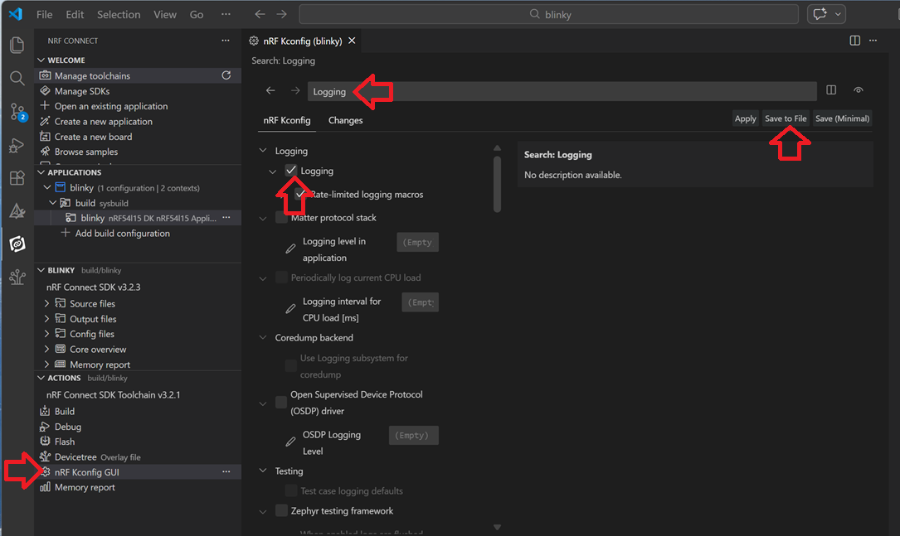

# KCONFIG: Adding Zephyr Logging

1) First, we add the Zephyr Logging software module to our project. To do this, we copy the following KCONFIG definition into the _prj.conf_ file.

       # Enable Logging
       CONFIG_LOG=y

   Or, if you want to enable Zephyr logging via the KCONFIG tool:
   a) open the KCONFIG GUI tool,
   b) search for Logging,
   c) and enable it.
   d) Press _Save to File_ button and select <code>prj.conf</code> file.

   

2) In __main.c__ file add following lines after the <code>#include <...></code> instructions.

       #include <zephyr/logging/log.h>

       /* LOG MODULE REGISTRATION */
       LOG_MODULE_REGISTER(MyApp,LOG_LEVEL_INF);

3) Let's use Logging instead of the <code>printf()</code> instruction. Replace the line <code>printf("LED state: %s\n", led_state ? "ON" : "OFF");</code> by the following one:

       LOG_INF("LED state: %s", led_state ? "ON" : "OFF");
   
